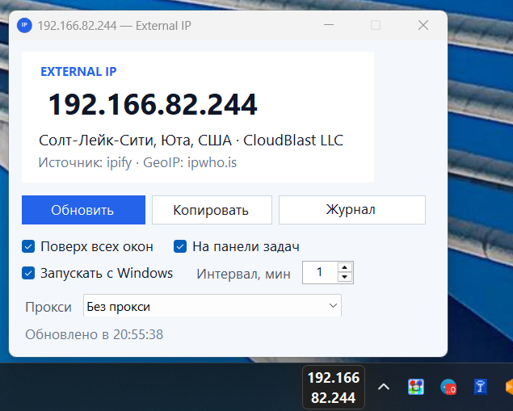
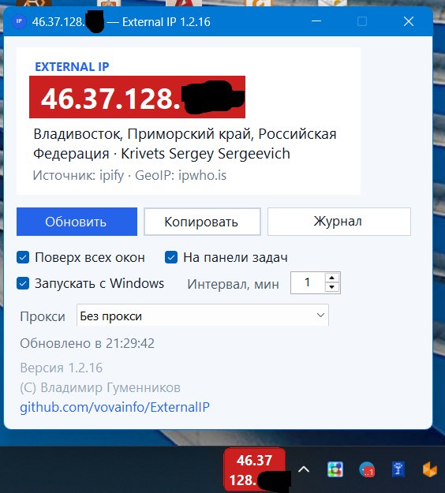

# External IP

Небольшое приложение для Windows. Оно показывает внешний IP-адрес компьютера — тот, который видят сайты.

Скачать готовый exe: [последний релиз](https://github.com/vovainfo/ExternalIP/releases/latest) (`ExternalIpWidget-win-x64.exe`, отдельно ставить .NET не нужно).

Адрес **не читается с сетевой карты**. За роутером у карты локальный адрес (`192.168.*`, `10.*`, `172.16–31.*` или адрес CGNAT `100.64.*`), а в интернет машина выходит с другим адресом. Виджет спрашивает об этом внешний сервис: «с какого адреса пришёл запрос?» и показывает ответ.



Адрес показан и на панели задач. Если он относится к России, адрес выделяется красным — и в окне, и на панели задач.



## Что умеет

- Запрашивает внешний IP по HTTPS и переходит к следующему сервису, если текущий не ответил. Каждая проверка открывает новое соединение, поэтому смена VPN видна сразу, без перезапуска.
- Сервисы по порядку: [ipify](https://api.ipify.org), [icanhazip](https://ipv4.icanhazip.com), [AWS checkip](https://checkip.amazonaws.com), [ifconfig.me](https://ifconfig.me/ip), [ipinfo](https://ipinfo.io/ip). Запрос к каждому идёт по IPv4: сервис видит IPv4-подключение и отвечает внешним IPv4. Если в ответе всё же IPv6, этот ответ пропускается.
- Подключение к сервисам выбирается списком «Прокси»: без прокси, переменная окружения `HTTP_PROXY` (для HTTPS сначала `HTTPS_PROXY`, затем `HTTP_PROXY`, затем `ALL_PROXY`), системный прокси Windows или свой адрес. Для переменной и системного прокси рядом показаны их значения. Свой адрес вводится как `хост:порт` или `http://хост:порт` и сохраняется.
- Показывает страну, город и провайдера этого внешнего адреса через GeoIP ([ipwho.is](https://ipwho.is/), [geojs](https://www.geojs.io/), [ipinfo](https://ipinfo.io/)). Справочник получает уже найденный внешний IP, а не адрес сетевой карты. Это местоположение адреса в интернете, не координаты компьютера. Если справочник относит адрес к России, сам адрес показывается на красном фоне — и в окне, и на панели задач. Пока адрес тот же, справочник повторно не запрашивается и подпись места не перерисовывается — окно из-за этого не дёргается.
- Показывает внешний IP прямо на панели задач, слева от часов, в две строки: сверху первые два октета, снизу два последних. Шрифт крупнее, плашка короче. Её можно перетащить вдоль панели. Щелчок по ней открывает окно. Правый щелчок открывает меню: открыть, обновить, копировать, убрать с панели и «Выход». Если адрес обновить не удалось, на панели задач написано Error, а в окне вместо адреса — «Не удалось обновить адрес».
- Копирует адрес в буфер, обновляется по таймеру и по F5.
- Кнопка «Журнал запросов» открывает отдельное окно: откуда взялся прокси, DNS, куда подключились, код ответа и текст сервиса. Кнопка «Копировать журнал» в этом окне кладёт его в буфер.
- Может оставаться поверх других окон и запускаться вместе с Windows.
- Сворачивается в область уведомлений. Выход — пункт «Выход» в меню значка в трее или плашки на панели задач.
- Повторный запуск открывает уже работающее окно и возвращает его на экран, если оно оказалось за пределами монитора.

## Сборка

Нужен [.NET 10 SDK](https://dotnet.microsoft.com/download/dotnet/10.0). Команды ниже рассчитаны на Windows. Собрать проект можно и на другой системе: в нём включено `EnableWindowsTargeting`, но само окно запускается только в Windows.

Проще всего дважды щёлкнуть `build.cmd`. Скрипт соберёт один exe, которому не нужен отдельно установленный runtime:

`dist\win-x64-selfcontained\ExternalIpWidget.exe`

Обычная сборка из PowerShell (на компьютере должен быть [.NET 10 Desktop Runtime](https://dotnet.microsoft.com/download/dotnet/10.0)):

```powershell
.\scripts\publish-windows.ps1
```

Один exe без установленного runtime:

```powershell
.\scripts\publish-windows.ps1 -SelfContained
```

Готовый файл: `dist\win-x64\ExternalIpWidget.exe` или `dist\win-x64-selfcontained\ExternalIpWidget.exe`.

Проверка логики определения адреса (её можно запустить и не в Windows):

```powershell
dotnet test
```

## Как убедиться, что адрес внешний

1. Запустите виджет.
2. Откройте в браузере https://api.ipify.org — строка должна совпасть с крупным адресом в окне.
3. В командной строке выполните `ipconfig`. IPv4-адрес адаптера будет другим, если компьютер за роутером: виджет показывает не его, а ответ внешнего сервиса.
